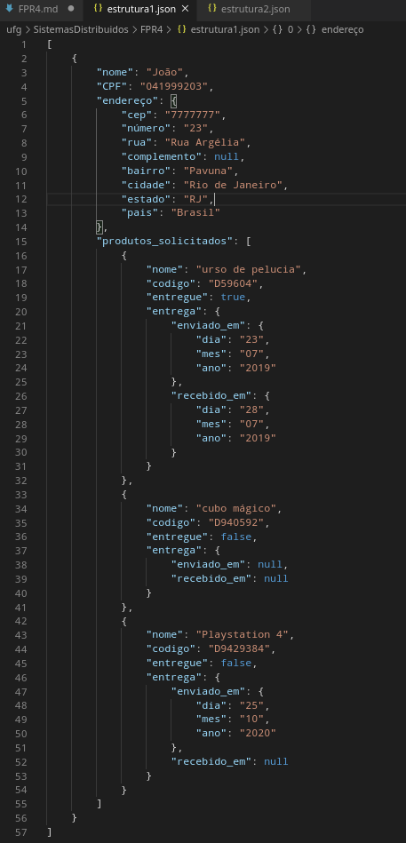
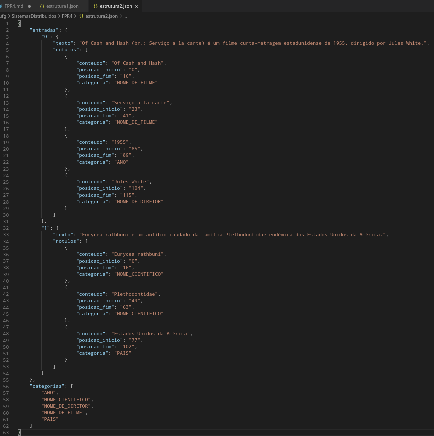
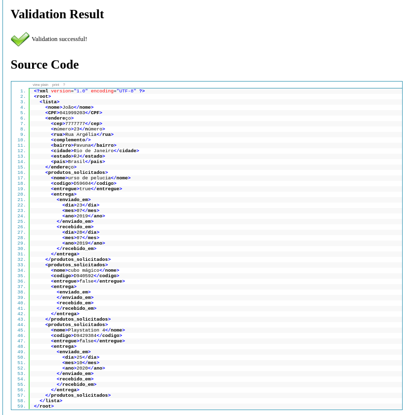
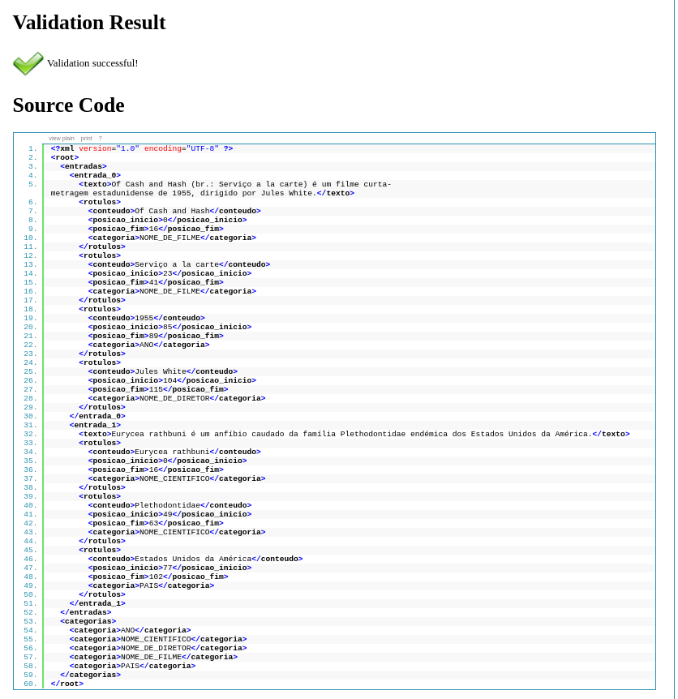

# FPR4


## **1) Sobre JSON, crie 3 exemplos:**
## **1.1) De duas estruturas de dados JSON (http://json.org/) válidos e criativos, utilize obrigatoriamente listas utilizando arrays com [] e 'sub-objetos' com chaves {}. Mostre que seu JSON foi verificado online (https://jsonlint.com/) ou por algum plugin (vscode, por exemplo).**

Primeiro exemplo:

```json
[
    {
        "nome": "João",
        "CPF": "041999203",
        "endereço": {
            "cep": "7777777",
            "número": "23",
            "rua": "Rua Argélia",
            "complemento": null,
            "bairro": "Pavuna",
            "cidade": "Rio de Janeiro",
            "estado": "RJ",
            "pais": "Brasil"
        },
        "produtos_solicitados": [
            {
                "nome": "urso de pelucia",
                "codigo": "D59604",
                "entregue": true,
                "entrega": {
                    "enviado_em": {
                        "dia": "23",
                        "mes": "07",
                        "ano": "2019"
                    },
                    "recebido_em": {
                        "dia": "28",
                        "mes": "07",
                        "ano": "2019"
                    }
                }
            },
            {
                "nome": "cubo mágico",
                "codigo": "D940592",
                "entregue": false,
                "entrega": {
                    "enviado_em": null,
                    "recebido_em": null
                }
            },
            {
                "nome": "Playstation 4",
                "codigo": "D9429384",
                "entregue": false,
                "entrega": {
                    "enviado_em": {
                        "dia": "25",
                        "mes": "10",
                        "ano": "2020"
                    },
                    "recebido_em": null
                }
            }            
        ]
    }
]
```

Segundo exemplo:

```json
{
    "entradas": {
        "0": {
            "texto": "Of Cash and Hash (br.: Serviço a la carte) é um filme curta-metragem estadunidense de 1955, dirigido por Jules White.",
            "rotulos": [
                {
                    "conteudo": "Of Cash and Hash",
                    "posicao_inicio": "0",
                    "posicao_fim": "16",
                    "categoria": "NOME_DE_FILME"
                },
                {
                    "conteudo": "Serviço a la carte",
                    "posicao_inicio": "23",
                    "posicao_fim": "41",
                    "categoria": "NOME_DE_FILME"
                },
                {
                    "conteudo": "1955",
                    "posicao_inicio": "85",
                    "posicao_fim": "89",
                    "categoria": "ANO"
                },
                {
                    "conteudo": "Jules White",
                    "posicao_inicio": "104",
                    "posicao_fim": "115",
                    "categoria": "NOME_DE_DIRETOR"
                }
            ]
        },
        "1": {
            "texto": "Eurycea rathbuni é um anfíbio caudado da família Plethodontidae endémica dos Estados Unidos da América.",
            "rotulos": [
                {
                    "conteudo": "Eurycea rathbuni",
                    "posicao_inicio": "0",
                    "posicao_fim": "16",
                    "categoria": "NOME_CIENTIFICO"
                },
                {
                    "conteudo": "Plethodontidae",
                    "posicao_inicio": "49",
                    "posicao_fim": "63",
                    "categoria": "NOME_CIENTIFICO"
                },
                {
                    "conteudo": "Estados Unidos da América",
                    "posicao_inicio": "77",
                    "posicao_fim": "102",
                    "categoria": "PAIS"
                }                
            ]
        }
    },
    "categorias": [
        "ANO",
        "NOME_CIENTIFICO",
        "NOME_DE_DIRETOR",
        "NOME_DE_FILME",
        "PAIS"
    ]
}
```

A verificação de ambos exemplos na IDE vscode mostra que não ocorrem erros ( que seriam indicados por traços sublinhados vermelhos ):





## **1.2) Faça o equivalente do item 1.1 em um XML. De forma análoga, valide o arquivo XML.**

Primeiro exemplo:

```xml
<?xml version="1.0" encoding="UTF-8" ?>
<root>
  <lista>
    <nome>João</nome>
    <CPF>041999203</CPF>
    <endereço>
      <cep>7777777</cep>
      <número>23</número>
      <rua>Rua Argélia</rua>
      <complemento/>
      <bairro>Pavuna</bairro>
      <cidade>Rio de Janeiro</cidade>
      <estado>RJ</estado>
      <pais>Brasil</pais>
    </endereço>
    <produtos_solicitados>
      <nome>urso de pelucia</nome>
      <codigo>D59604</codigo>
      <entregue>true</entregue>
      <entrega>
        <enviado_em>
          <dia>23</dia>
          <mes>07</mes>
          <ano>2019</ano>
        </enviado_em>
        <recebido_em>
          <dia>28</dia>
          <mes>07</mes>
          <ano>2019</ano>
        </recebido_em>
      </entrega>
    </produtos_solicitados>
    <produtos_solicitados>
      <nome>cubo mágico</nome>
      <codigo>D940592</codigo>
      <entregue>false</entregue>
      <entrega>
        <enviado_em>
        </enviado_em>
        <recebido_em>
        </recebido_em>
      </entrega>
    </produtos_solicitados>
    <produtos_solicitados>
      <nome>Playstation 4</nome>
      <codigo>D9429384</codigo>
      <entregue>false</entregue>
      <entrega>
        <enviado_em>
          <dia>25</dia>
          <mes>10</mes>
          <ano>2020</ano>
        </enviado_em>
        <recebido_em>
        </recebido_em>
      </entrega>
    </produtos_solicitados>
  </lista>
</root>
```

Segundo exemplo:

```xml
<?xml version="1.0" encoding="UTF-8" ?>
<root>
  <entradas>
    <0>
      <texto>Of Cash and Hash (br.: Serviço a la carte) é um filme curta-metragem estadunidense de 1955, dirigido por Jules White.</texto>
      <rotulos>
        <conteudo>Of Cash and Hash</conteudo>
        <posicao_inicio>0</posicao_inicio>
        <posicao_fim>16</posicao_fim>
        <categoria>NOME_DE_FILME</categoria>
      </rotulos>
      <rotulos>
        <conteudo>Serviço a la carte</conteudo>
        <posicao_inicio>23</posicao_inicio>
        <posicao_fim>41</posicao_fim>
        <categoria>NOME_DE_FILME</categoria>
      </rotulos>
      <rotulos>
        <conteudo>1955</conteudo>
        <posicao_inicio>85</posicao_inicio>
        <posicao_fim>89</posicao_fim>
        <categoria>ANO</categoria>
      </rotulos>
      <rotulos>
        <conteudo>Jules White</conteudo>
        <posicao_inicio>104</posicao_inicio>
        <posicao_fim>115</posicao_fim>
        <categoria>NOME_DE_DIRETOR</categoria>
      </rotulos>
    </0>
    <1>
      <texto>Eurycea rathbuni é um anfíbio caudado da família Plethodontidae endémica dos Estados Unidos da América.</texto>
      <rotulos>
        <conteudo>Eurycea rathbuni</conteudo>
        <posicao_inicio>0</posicao_inicio>
        <posicao_fim>16</posicao_fim>
        <categoria>NOME_CIENTIFICO</categoria>
      </rotulos>
      <rotulos>
        <conteudo>Plethodontidae</conteudo>
        <posicao_inicio>49</posicao_inicio>
        <posicao_fim>63</posicao_fim>
        <categoria>NOME_CIENTIFICO</categoria>
      </rotulos>
      <rotulos>
        <conteudo>Estados Unidos da América</conteudo>
        <posicao_inicio>77</posicao_inicio>
        <posicao_fim>102</posicao_fim>
        <categoria>PAIS</categoria>
      </rotulos>
    </1>
  </entradas>
  <categorias>
    <categoria>ANO</categoria>
    <categoria>NOME_CIENTIFICO</categoria>
    <categoria>NOME_DE_DIRETOR</categoria>
    <categoria>NOME_DE_FILME</categoria>
    <categoria>PAIS</categoria>
  </categorias>
</root>
```

Os arquivos XML foram validados com sucesso em [http://xmlvalidator.new-studio.org/](http://xmlvalidator.new-studio.org/).





**1.3) Realize operações de criação, alteração, listar propriedades (keys), valores e cópia (assign) ao seu objeto 1.1, usando sintaxe mais recente (ES6): https://www.digitalocean.com/community/tutorials/how-to-use-object-methods-in-javascript**

Programa:

```javascript
let json_information = [
    {
        "nome": "João",
        "CPF": "041999203",
        "endereço": {
            "cep": "7777777",
            "número": "23",
            "rua": "Rua Argélia",
            "complemento": null,
            "bairro": "Pavuna",
            "cidade": "Rio de Janeiro",
            "estado": "RJ",
            "pais": "Brasil"
        },
        "produtos_solicitados": [
            {
                "nome": "urso de pelucia",
                "codigo": "D59604",
                "entregue": true,
                "entrega": {
                    "enviado_em": {
                        "dia": "23",
                        "mes": "07",
                        "ano": "2019"
                    },
                    "recebido_em": {
                        "dia": "28",
                        "mes": "07",
                        "ano": "2019"
                    }
                }
            },
            {
                "nome": "cubo mágico",
                "codigo": "D940592",
                "entregue": false,
                "entrega": {
                    "enviado_em": null,
                    "recebido_em": null
                }
            },
            {
                "nome": "Playstation 4",
                "codigo": "D9429384",
                "entregue": false,
                "entrega": {
                    "enviado_em": {
                        "dia": "25",
                        "mes": "10",
                        "ano": "2020"
                    },
                    "recebido_em": null
                }
            }            
        ]
    }
]

// Operação de criação
let json_object = Object.create(json_information);

// Operação de alteração
console.log('Campo "json_object[0].nome" no objeto original: ', json_object[0].nome)
json_object[0].nome = "Maria";
json_object[0]['endereço']['cep'] = '0000000';
console.log('Campo "json_object[0].nome" no objeto alterado: ', json_object[0].nome)

// Operação de listar propriedades

// Código da biblioteca 'flatten' https://github.com/hughsk/flat
  function flatten (target, opts) {
    function isBuffer (obj) {
        return obj &&
          obj.constructor &&
          (typeof obj.constructor.isBuffer === 'function') &&
          obj.constructor.isBuffer(obj)
    }
      function keyIdentity (key) {
        return key
      }
    opts = opts || {}
  
    const delimiter = opts.delimiter || '.'
    const maxDepth = opts.maxDepth
    const transformKey = opts.transformKey || keyIdentity
    const output = {}
  
    function step (object, prev, currentDepth) {
      currentDepth = currentDepth || 1
      Object.keys(object).forEach(function (key) {
        const value = object[key]
        const isarray = opts.safe && Array.isArray(value)
        const type = Object.prototype.toString.call(value)
        const isbuffer = isBuffer(value)
        const isobject = (
          type === '[object Object]' ||
          type === '[object Array]'
        )
  
        const newKey = prev
          ? prev + delimiter + transformKey(key)
          : transformKey(key)
  
        if (!isarray && !isbuffer && isobject && Object.keys(value).length &&
          (!opts.maxDepth || currentDepth < maxDepth)) {
          return step(value, newKey, currentDepth + 1)
        }
  
        output[newKey] = value
      })
    }
  
    step(target)
  
    return output
  }

let result = flatten(json_object[0])
result = Object.keys(result)
console.log('Listagem de propriedades do objeto: \n', result)

// Operação de listar valores

result = flatten(json_object[0])
result = Object.values(result)
console.log('Listagem de valores do objeto: \n', result)

// Operação de realizar cópia

// Precisamos fazer um deep copy do JSON:
let copy = JSON.parse(JSON.stringify(json_object[0]));

// Vamos deletar o objeto original:
delete json_object;

// O objeto copiado ainda existe:
console.log('Objeto copiado: \n', JSON.stringify(copy))
```

Saída produzida pelo programa:

```
Campo "json_object[0].nome" no objeto original:  João
Campo "json_object[0].nome" no objeto alterado:  Maria

Listagem de propriedades do objeto: 

 [
  'nome',
  'CPF',
  'endereço.cep',
  'endereço.número',
  'endereço.rua',
  'endereço.complemento',
  'endereço.bairro',
  'endereço.cidade',
  'endereço.estado',
  'endereço.pais',
  'produtos_solicitados.0.nome',
  'produtos_solicitados.0.codigo',
  'produtos_solicitados.0.entregue',
  'produtos_solicitados.0.entrega.enviado_em.dia',
  'produtos_solicitados.0.entrega.enviado_em.mes',
  'produtos_solicitados.0.entrega.enviado_em.ano',
  'produtos_solicitados.0.entrega.recebido_em.dia',
  'produtos_solicitados.0.entrega.recebido_em.mes',
  'produtos_solicitados.0.entrega.recebido_em.ano',
  'produtos_solicitados.1.nome',
  'produtos_solicitados.1.codigo',
  'produtos_solicitados.1.entregue',
  'produtos_solicitados.1.entrega.enviado_em',
  'produtos_solicitados.1.entrega.recebido_em',
  'produtos_solicitados.2.nome',
  'produtos_solicitados.2.codigo',
  'produtos_solicitados.2.entregue',
  'produtos_solicitados.2.entrega.enviado_em.dia',
  'produtos_solicitados.2.entrega.enviado_em.mes',
  'produtos_solicitados.2.entrega.enviado_em.ano',
  'produtos_solicitados.2.entrega.recebido_em'
]

Listagem de valores do objeto: 

 [
  'Maria',           '041999203',
  '0000000',         '23',
  'Rua Argélia',     null,
  'Pavuna',          'Rio de Janeiro',
  'RJ',              'Brasil',
  'urso de pelucia', 'D59604',
  true,              '23',
  '07',              '2019',
  '28',              '07',
  '2019',            'cubo mágico',
  'D940592',         false,
  null,              null,
  'Playstation 4',   'D9429384',
  false,             '25',
  '10',              '2020',
  null
]

Objeto copiado: 

 {"nome":"Maria","CPF":"041999203","endereço":{"cep":"0000000","número":"23","rua":"Rua Argélia","complemento":null,"bairro":"Pavuna","cidade":"Rio de Janeiro","estado":"RJ","pais":"Brasil"},"produtos_solicitados":[{"nome":"urso de pelucia","codigo":"D59604","entregue":true,"entrega":{"enviado_em":{"dia":"23","mes":"07","ano":"2019"},"recebido_em":{"dia":"28","mes":"07","ano":"2019"}}},{"nome":"cubo mágico","codigo":"D940592","entregue":false,"entrega":{"enviado_em":null,"recebido_em":null}},{"nome":"Playstation 4","codigo":"D9429384","entregue":false,"entrega":{"enviado_em":{"dia":"25","mes":"10","ano":"2020"},"recebido_em":null}}]}
```

2. Complete o tutorial REST apresentado em sala de aula, implementando seu próprio exemplo, incluindo obrigatoriamente:
2.1) persistir as modificações no arquivo users.json
2.2) pelo menos mais uma pesquisa parametrizada, por id ou outra propriedade da pessoa
2.3) uma mesma funcionalidade, por exemplo "deletar pessoa", implementada no mesmo caminho, mas com variações de comando, por exemplo:
usando GET, com caminho /deleteUser/1
usando DELETE, com corpo body JSON: {"user": "1"}
usando POST, com corpo body JSON: {"user": "1"}

```javascript
var express = require('express');
var app = express();
var fs = require("fs").promises;
var bodyParser = require('body-parser');

// parse application/json
app.use(bodyParser.json())

app.get('/listUsers', function (req, res) {
   fs.readFile( __dirname + "/" + "users.json", 'utf8', function (err, data) {
      console.log( data );
      res.end( data );
   });
})

async function getUsername(object){
    let object_keys = Object.keys(object);
    let object_numbers = [];
    object_keys.forEach(element => object_numbers.push(element.match(/\d+/)[0]))
    let toNumbers = arr => arr.map(Number);
    object_numbers = toNumbers(object_numbers);
    max_value = Math.max(...object_numbers) + 1;
    max_value = 'user' + max_value.toString();
    return max_value;
}

app.post('/addUser', async function (req, res) {
    const file = await fs.readFile( __dirname + "/" + "users.json");
    let fileJSON = JSON.parse(file.toString());
    let new_username = await getUsername(fileJSON);
    fileJSON[new_username] = req.body;
    let json_dump = JSON.stringify(fileJSON, null, 2)
    // 2.1) persistir as modificações no arquivo users.json
    await fs.writeFile(__dirname + "/" + "users.json", json_dump);
    res.sendStatus(200);
 })

 app.get('/id/:id', async function (req, res) {
    const file = await fs.readFile( __dirname + "/" + "users.json");
    let fileJSON = JSON.parse(file.toString());
    let selected_users = {}
    for(user in fileJSON){
        if (fileJSON[user]['id'] === req.params.id){
            selected_users[user] = fileJSON[user]
        }
    }
    console.log(selected_users);
    res.sendStatus(200);
 });


//  2.2) pelo menos mais uma pesquisa parametrizada, por id ou outra propriedade da pessoa
 app.get('/profession/:profession', async function (req, res) {
    const file = await fs.readFile( __dirname + "/" + "users.json");
    let fileJSON = JSON.parse(file.toString());
    let selected_users = {}
    for(user in fileJSON){
        if (fileJSON[user]['profession'] === req.params.profession){
            selected_users[user] = fileJSON[user]
        }
    }
    console.log(selected_users);
    res.sendStatus(200);
 });

//  2.3) uma mesma funcionalidade, por exemplo "deletar pessoa", implementada no mesmo caminho, mas com variações de comando, por exemplo:
//  usando GET, com caminho /deleteUser/1
//  usando DELETE, com corpo body JSON: {"user": "1"}
//  usando POST, com corpo body JSON: {"user": "1"} 
 app.delete('/deleteUser', async function (req, res) {
    const file = await fs.readFile( __dirname + "/" + "users.json");
    let fileJSON = JSON.parse(file.toString());
    let username = 'user' + fileJSON['user'].toString();
    delete fileJSON[username];
    let json_dump = JSON.stringify(fileJSON, null, 2)
    // 2.1) persistir as modificações no arquivo users.json
    await fs.writeFile(__dirname + "/" + "users.json", json_dump);
    res.sendStatus(200);
 })


//  2.3) uma mesma funcionalidade, por exemplo "deletar pessoa", implementada no mesmo caminho, mas com variações de comando, por exemplo:
//  usando GET, com caminho /deleteUser/1
//  usando DELETE, com corpo body JSON: {"user": "1"}
//  usando POST, com corpo body JSON: {"user": "1"} 
 app.get('/deleteUser/:id', async function (req, res) {
    const file = await fs.readFile( __dirname + "/" + "users.json");
    let fileJSON = JSON.parse(file.toString());
    let username = 'user' + req.params.id.toString();
    delete fileJSON[username];
    let json_dump = JSON.stringify(fileJSON, null, 2)
    // 2.1) persistir as modificações no arquivo users.json
    await fs.writeFile(__dirname + "/" + "users.json", json_dump);
    res.sendStatus(200);
 })

//  2.3) uma mesma funcionalidade, por exemplo "deletar pessoa", implementada no mesmo caminho, mas com variações de comando, por exemplo:
//  usando GET, com caminho /deleteUser/1
//  usando DELETE, com corpo body JSON: {"user": "1"}
//  usando POST, com corpo body JSON: {"user": "1"} 
 app.post('/deleteUser' , async function (req, res) {
    const file = await fs.readFile( __dirname + "/" + "users.json");
    let fileJSON = JSON.parse(file.toString());
    let username = 'user' + fileJSON['user'].toString();
    delete fileJSON[username];
    let json_dump = JSON.stringify(fileJSON, null, 2)
    await fs.writeFile(__dirname + "/" + "users.json", json_dump);
    res.sendStatus(200);
 })

var server = app.listen(8081, function () {
   var host = server.address().address
   var port = server.address().port
   console.log("Example app listening at http://%s:%s", host, port)
})
```